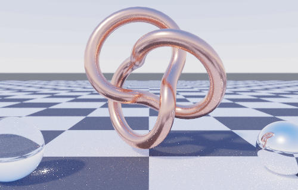
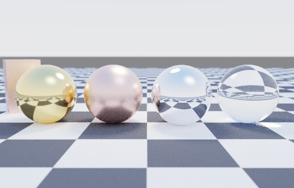
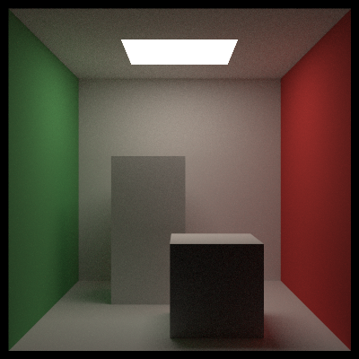
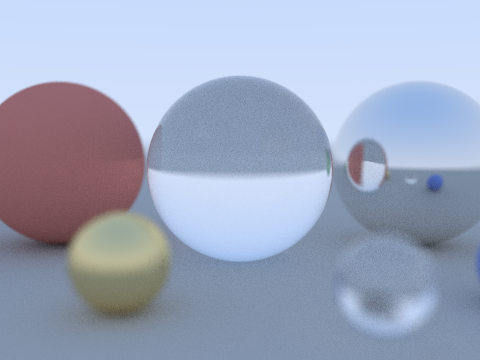
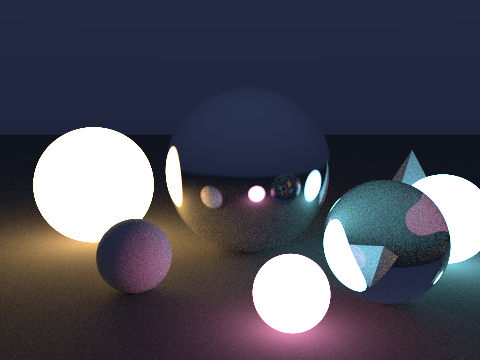

# PathTracer - a physics-validated Monte Carlo path tracer in TypeScript

[](https://github.com/Leo-Y-Zhang/PathTracer/actions/workflows/ci.yml)

PathTracer turns a JSON scene description into a rendered image by simulating
how light actually travels: it traces rays back from the camera, bounce by
bounce, until they find a light.

A physically-based Monte Carlo path tracer written in TypeScript for Node,
with **zero runtime dependencies**. It renders JSON-described scenes to PNG
offline, **deterministically**: the same CLI invocation always produces
byte-identical bytes, single- or multi-threaded. It has **next-event estimation
with multiple importance sampling**, **HDR image-based lighting** (an in-tree
Radiance `.hdr` decoder + a luminance-weighted environment sampler inside the
NEE mixture), **energy-compensated GGX microfacet** materials (conductor +
frosted glass), **textures** (procedural +
PNG-decoded), **triangle meshes** (OBJ, smooth normals) and affine **instance
transforms**, filmic tone mapping, a sky model, stratified sampling and a
**worker-thread tile renderer**. The test suite validates the *rendering
physics* - energy conservation, unbiasedness, sampling distributions, fresnel -
not just the code.

## Gallery

All images are rendered by this repository's code via `npm run render:all`
(deterministic - re-running reproduces these exact files).



*Skylight (500x320): a copper GGX (2,3)-torus-knot OBJ mesh (smooth normals,
instance transform), glass and silver spheres, lit entirely by a committed
equirectangular HDR sky that next-event estimation importance-samples. Both
assets are generated deterministically by in-tree scripts (`npm run
assets:all`) - nothing downloaded.*



*Showcase (500x320): gold / copper / silver GGX metals at rising roughness, a
refracting glass sphere and a rotated box over a checker-textured floor under
the analytic sky, with depth of field and ACES tone mapping.*

| Cornell box (NEE) | Glass & metal (depth of field) | Emissive night (NEE) |
| --- | --- | --- |
|  |  |  |
| 400x400, 250 spp | 480x360, 260 spp | 480x360, 220 spp |

## Features

- **Zero runtime dependencies.** `dependencies: {}`. The PNG encoder,
  CRC-32, RNG, vector math, BVH and integrator are all in-tree; the only
  outside code is raw DEFLATE injected from the `node:zlib` builtin.
- **Integrator:** unidirectional path tracing with **next-event estimation +
  multiple importance sampling** (power heuristic) - light sampling and BSDF
  sampling combined so small lights converge fast without bias - plus russian
  roulette after 3 bounces. Tests prove NEE matches pure path tracing in the
  mean (unbiased) while cutting variance sharply.
- **HDR image-based lighting:** an equirectangular Radiance `.hdr` environment
  (decoded by an **in-tree RGBE codec** - header, RLE + flat scanlines,
  EXPOSURE) importance-sampled through a **luminance-weighted 2D CDF** and
  entered into the NEE light mixture alongside area lights: shadow rays that
  escape the scene collect environment radiance, BSDF rays that escape are
  MIS-weighted against the mixture pdf, and the same object is the miss
  shader - so the sampler and the background cannot disagree. A constant-color
  environment variant doubles as the furnace-test light.
- **Materials:** lambertian, textured lambertian, a physically-based **GGX
  microfacet conductor** (Cook-Torrance D/G/F, importance-sampled) with
  **Kulla-Conty multiple-scattering energy compensation** - deterministic
  quadrature energy tables built at material construction (no baked data, so
  they can never drift from the BRDF they compensate); an albedo-1 furnace
  closes to 1 at every roughness instead of dropping to 0.32 - a **rough
  dielectric** (frosted glass: Walter 2007 GGX reflection + refraction, exact
  dielectric Fresnel, per-side energy scaling), metal, smooth dielectric
  (Schlick fresnel + TIR), and diffuse emissive lights. Non-specular
  materials expose a BRDF + pdf so they work under NEE.
- **Geometry:** spheres, axis-aligned rects and boxes, triangles
  (Moller-Trumbore) with optional **smooth normals + UVs**, **OBJ triangle
  meshes**, and affine **instance transforms** (translate / rotate / scale, so
  geometry need not be axis-aligned). AABBs and a **median-split BVH** proven
  in tests to match brute-force intersection. Rects and spheres also serve as
  importance-sampled area lights.
- **Textures:** procedural solid + checker, and PNG **image textures** decoded
  by an in-tree PNG decoder (all five scanline filters, CRC-verified). UVs on
  spheres, rects, boxes and meshes.
- **Camera & output:** thin-lens camera with defocus blur; **linear / reinhard /
  aces** tone operators with exposure; an analytic **sun + sky** background;
  **stratified** sub-pixel sampling; 8-bit RGB PNG.
- **Parallel & deterministic:** a **worker-thread tile renderer** whose output
  is byte-identical to the single-threaded pass, backed by an xorshift128 RNG
  seeded purely from `(x, y, sampleIndex, seed)` - no `Math.random` anywhere
  (SHA-256-asserted in tests).

## Install

```bash
git clone <this repo>
cd PathTracer
npm ci
npm test          # builds, then runs 276 tests (32 suites)
npm run typecheck # strict tsc --noEmit (separate from npm test)
```

Requires Node >= 20. No runtime dependencies are installed - the only dev
dependencies are `typescript`, `vitest`, `@types/node` and the ESLint
toolchain.

## Quickstart

```bash
npm run build
node dist/cli.js render scenes/cornell.json --out renders/cornell.png --workers 4
```

Real observed output (Node 25; next-event estimation keeps the cornell scene
clean at 250 spp, and four workers render it in about half a minute):

```text
cornell: rendering with 4 worker threads...
wrote renders/cornell.png (285408 bytes) in 33.9s
```

`npm run render:all` regenerates the whole committed gallery deterministically.
Flags: `--out`, `--spp`, `--seed`, `--width`, `--height`, `--max-depth`,
`--workers`; defaults come from the scene's `render` block, and `--width` alone
preserves the scene's aspect ratio. Multi-worker output is byte-identical to a
single-threaded render. Progress goes to stderr.

## How path tracing works (honestly)

The rendering equation says the light leaving a surface point x toward the
camera is its own emission plus the integral, over all incoming directions,
of incoming light weighted by the BRDF and the cosine of the incidence angle:

    L_o(x, w_o) = L_e(x, w_o) + INTEGRAL_hemisphere f(x, w_i, w_o) L_i(x, w_i) cos(theta_i) dw_i

That integral has no closed form for real scenes, so we estimate it with
Monte Carlo: shoot a random ray, divide by the probability density of having
chosen it. One camera ray becomes a random walk - at each bounce the path
throughput is multiplied by `BRDF * cos / pdf`, and emission found along the
way is added, weighted by throughput. Averaging many such walks per pixel
converges to the true integral because the estimator is **unbiased**: its
expected value *is* the integral. Importance sampling (cosine-weighted
directions for diffuse surfaces) and russian roulette (randomly killing long
paths and compensating survivors by 1/p) reduce variance and cost without
introducing bias.

**Why the furnace test matters:** unbiasedness is an easy thing to break
silently - a wrong pdf, a missing cosine, a normalization slip in the BRDF,
or biased roulette all still produce pretty pictures, just *wrong* ones. The
furnace test catches this class of bug: a lambertian sphere of albedo 0.5
inside a uniform emissive environment of radiance 1 must render to radiance
exactly 0.5 (the sphere is convex, so `L = albedo * L_env`). The suite
asserts the mean rendered radiance within 1%, plus a *white* furnace (albedo
1.0 box interior, forcing many bounces through russian roulette) that must
converge to exactly 1.0 - any energy leak or gain fails the test.

## The validation centerpiece

Tests validate physics against analytic ground truth, not snapshots:

| Test | Asserts |
| --- | --- |
| **Furnace test** (`tests/integrator.test.ts`) | albedo-0.5 sphere in a radiance-1 environment renders to mean 0.5 (and 0.8 -> 0.8) |
| **White furnace / russian roulette** | multi-bounce albedo-1.0 enclosure converges to 1.0 - roulette is unbiased |
| **Environment furnace** (`tests/envnee.test.ts`) | with the environment inside the NEE mixture, an albedo-0.5 sphere under a constant-radiance environment still renders to exactly 0.5 - including end-to-end through the `.hdr` file path (RGBE encode -> decode -> CDF); env + area lights mix unbiasedly |
| **Env-sampling pdf** (`tests/envlight.test.ts`) | the environment pdf integrates to exactly 1 (texel-aligned quadrature), matches an independent uniform-direction solid-angle estimate, and E[1/pdf] over its own samples is 4 pi |
| **Next-event estimation** (`tests/nee.test.ts`) | NEE matches pure path tracing in the mean (unbiased) and cuts variance >40% at low spp; deterministic |
| **GGX energy** (`tests/ggx.test.ts`) | the GGX NDF integrates to 1; an albedo-1 rough-conductor white furnace never gains energy; BRDF reciprocal |
| **GGX energy compensation** (`tests/ggx_energy.test.ts`) | the albedo-1 conductor furnace closes to (0.98, 1.02) at every roughness with the Kulla-Conty ms lobe (0.32 at roughness 1 without it); quadrature E(mu) matches independent Monte Carlo over the actual sampler; E[cos/pdf] = pi (the pdf is the true mixture density); reciprocity holds with the ms lobe; compensation only adds energy |
| **Rough dielectric** (`tests/rough_dielectric.test.ts`) | exact Fresnel: analytic r0, TIR beyond the critical angle, interface symmetry, Schlick agreement; the frosted-glass furnace closes at every roughness (0.36 at roughness 1 uncompensated); roughness-0 renders match the smooth Dielectric |
| **Area-light sampling** (`tests/light_sampling.test.ts`) | rect / sphere light pdf validated against an independent uniform-direction solid-angle estimate |
| **PNG decode** (`tests/png_decode.test.ts`) | encoder round-trip and all five scanline filters (Sub/Up/Average/Paeth) reconstructed |
| **RGBE / .hdr codec** (`tests/hdr.test.ts`) | known-answer RGBE conversions, RLE + flat scanline round-trips, header/format rejection, EXPOSURE applied |
| **Parallel determinism** (`tests/parallel.test.ts`) | multi-worker render byte-identical to single-threaded |
| **Cosine-weighted sampling** (`tests/materials.test.ts`) | mean cos(theta) = 2/3 (analytic value under pdf = cos/pi), correct hemisphere, uniform azimuth |
| **Fresnel** | Schlick at normal incidence equals ((n1-n2)/(n1+n2))^2; grazing incidence -> 1 |
| **Intersections** (`tests/sphere.test.ts`, `triangle`, `rect-box`) | hit t, point, normal and front-face flags against hand-computed values |
| **BVH = brute force** (`tests/bvh.test.ts`) | identical hits over seeded random scenes of mixed primitives |
| **Determinism** (`tests/determinism.test.ts`, `tests/cli.test.ts`) | same seed -> identical SHA-256 of PNG bytes, in-process and via the CLI |
| **PNG format** (`tests/png.test.ts`) | signature, IHDR dimensions, chunk CRCs vs known answers, DEFLATE roundtrip |

```bash
npm test          # 276 tests
npx tsc --noEmit  # strict, noUncheckedIndexedAccess
```

## Architecture

```
src/
  vec3.ts             immutable vector math (pure functions)
  ray.ts              ray type + evaluation
  rng.ts              xorshift128 + per-pixel-sample seeding (determinism)
  sampling.ts         sphere / disk / cosine-hemisphere / stratified samplers
  mat3.ts             3x3 matrices for instance transforms
  aabb.ts             axis-aligned bounding boxes (slab test)
  hittable.ts         HitRecord (incl. UVs), face-normal orientation, list
  lights.ts           AreaLight sampling API + LightList (NEE, incl. environment)
  hdr.ts              Radiance RGBE (.hdr) codec - header, RLE/flat scanlines
  envlight.ts         environment lights: constant + equirect map (2D CDF)
  microfacet.ts       GGX D / Smith G / Schlick + exact dielectric fresnel + half-vector sampling
  ggx-energy.ts       deterministic E(mu)/E_avg quadrature tables (energy compensation)
  texture.ts          solid / checker / PNG image textures
  sky.ts              analytic sun + sky background
  geometry/
    sphere.ts         quadratic intersection + area-light sampling + UVs
    rect.ts           axis-aligned rectangles + area-light sampling + UVs
    box.ts            axis-aligned solid boxes
    triangle.ts       Moller-Trumbore + optional smooth normals / UVs
    transform.ts      affine instance transform (scale / rotate / translate)
  io/obj.ts           Wavefront OBJ mesh loader
  bvh.ts              median-split BVH (documented strategy)
  materials.ts        lambertian / textured / GGX + ms lobe / metal / dielectrics / emissive
  camera.ts           thin-lens camera (fov, aperture, focus distance)
  integrator.ts       path tracer + NEE + MIS + row-band / full render
  parallel.ts         worker_threads tile renderer (deterministic)
  render-worker.ts    worker entry: parse scene + render a row band
  png.ts              PNG encoder + decoder (CRC-32 in-tree) + tone operators
  scene.ts            JSON scene schema parser (schema in the file header)
  cli.ts              argument parsing, progress, --workers, file output
  tools/              deterministic asset generators (sky .hdr, knot .obj)
scenes/               committed scenes (cornell, spheres, night, showcase, skylight)
assets/               committed .hdr + .obj, regenerated exactly by assets:all
renders/              committed gallery PNGs, reproducible via render:all
tests/                32 suites / 276 tests, including the furnace + NEE + GGX + environment validations
```

### Scene format

Documented in full in the header of `src/scene.ts`. Shape:

```jsonc
{
  "name": "cornell",
  "camera": { "position": [x,y,z], "lookAt": [x,y,z], "vfov": 40,
              "aperture": 0.0, "focusDist": 10 },        // aperture/focusDist optional
  "background": [r,g,b],                                  // or {type: gradient|sky, ...}
  "environment": { "type": "image", "path": "sky.hdr", "intensity": 1 },
                     // or {type: constant, color, intensity}; NEE-sampled light
                     // AND miss shader - mutually exclusive with "background"
  "render": { "width": 480, "height": 360, "spp": 256, "maxDepth": 32, "seed": 7,
              "toneMapping": "linear|reinhard|aces", "exposure": 1.0 },  // tone optional
  "textures":  { "name": { "type": "solid|checker|image", ... } },        // optional
  "materials": { "name": { "type": "lambertian|textured_lambertian|metal|dielectric|rough_dielectric|ggx|emissive", ... } },
  "objects": [
    { "type": "sphere|rect|box|triangle", ..., "material": "name" },
    { "type": "mesh", "path": "model.obj", "material": "name" },
    { "type": "transform", "object": { ... }, "translate": [x,y,z], "rotate": [x,y,z], "scale": 1.0 }
  ]
}
```

## Design documents

- [docs/PRD.md](docs/PRD.md) - the problem, who it is for, what is deliberately
  out of scope, and the alternatives that were rejected (with the reasons).
- [docs/TDD.md](docs/TDD.md) - the architecture as built: data model, the three
  contracts that hold the renderer together, trust boundaries, failure modes
  (including the two that are *not* detected) and rollback.

Both were written retrospectively, against the code rather than against this
README.

## Limitations (honest)

- **Deterministic per environment, not across environments.** Byte-identical
  output is guaranteed for repeated runs on the same Node/zlib build (the
  *pixels* always match; a different zlib could compress the IDAT differently).
- **The rough dielectric compensates by scaling, not a reciprocal lobe.** The
  GGX conductor's Kulla-Conty multiple-scattering lobe is reciprocal; the
  rough dielectric instead scales Walter's throughput weight by 1/E(mu_o),
  which closes the furnace exactly but breaks reciprocity (a non-issue for
  this camera-only unidirectional tracer). It is also NEE-skipped like the
  smooth dielectric, which costs variance (never bias) under small lights.
  High-IOR frosted glass converges slowly - heavy-tailed weights in deep
  TIR chains produce fireflies at low sample counts; measured figures are in
  the `GGXDielectric` docblock (`src/materials.ts`).
- **The analytic sky is not sampled by NEE.** The procedural sun + sky
  `background` lights surfaces through BSDF sampling only; for an
  importance-sampled sky, use an `environment` (constant or `.hdr` image),
  which joins emissive rects and spheres in the NEE mixture.
- **The environment map is nearest-texel sampled** (no bilinear filtering) - a
  deliberate choice that keeps the sampling pdf and the returned radiance
  exactly consistent per texel (which is what the quadrature test proves), at
  the cost of visible texels if a low-resolution map fills the background. The
  `.hdr` decoder accepts the standard `-Y h +X w` orientation only; anything
  else is rejected with a clear error.
- **No spectral rendering, participating media, denoising, or bidirectional /
  MLT.** Fresnel uses the Schlick approximation (exact at normal incidence) and
  the BVH is median-split (not SAH) - deliberate scope choices.

## Roadmap

- SAH BVH and a low-discrepancy (Sobol / Halton) sampler.
- A transmission eval/pdf pair so NEE can sample the rough dielectric directly.
- Bidirectional path tracing / MLT for difficult indirect light.

Done in 1.2.0: **GGX multiple-scattering energy compensation** (a reciprocal
Kulla-Conty ms lobe for conductors, deterministic quadrature energy tables
built at material construction) and a **rough dielectric** (frosted glass)
material - the albedo-1 furnaces now close at every roughness (the conductor
furnace read 0.32 at roughness 1 before).

Done in 1.1.0: **HDR image-based lighting sampled by NEE** (in-tree RGBE codec,
luminance-weighted CDF, environment furnace test) and the **skylight** gallery
scene (the OBJ mesh pipeline finally appears in a committed render).

Done in 1.0.0: **next-event estimation + MIS**, **GGX microfacets**, **textures**
(procedural + PNG image), **OBJ meshes + smooth normals**, **instance
transforms**, **tone operators + sky**, **stratified sampling**, and a
**worker-thread tile renderer**.

## License

Proprietary source-available - Copyright (c) 2026 Leo Y. Zhang. You may read,
run and check it; no reuse rights are granted. See [LICENSE](LICENSE).
